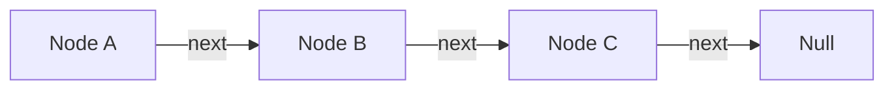

## 什麼是鏈結串列 (Linked List)？

鏈結串列是一種線性的資料結構，它由一系列的**節點 (node)** 組成。每個節點都包含兩個部分：

-   **資料 (Data):** 儲存節點的值。
-   **指標 (Pointer):** 指向串列中的下一個節點。



## 鏈結串列的類型

-   **單向鏈結串列 (Singly Linked List):** 每個節點只包含一個指向下一個節點的指標。
-   **雙向鏈結串列 (Doubly Linked List):** 每個節點包含兩個指標，一個指向上一個節點，另一個指向下一個節點。

## 鏈結串列的優點和缺點

**優點:**

-   **動態大小:** 鏈結串列的大小可以動態地增加或減少。
-   **插入和刪除容易:** 在鏈結串列中插入或刪除節點非常有效率。

**缺點:**

-   **隨機存取不易:** 無法像陣列一樣透過索引來直接存取節點，必須從頭開始遍歷。
-   **需要額外的記憶體:** 每個節點都需要額外的記憶體來儲存指標。

## JavaScript 實作

```javascript
class Node {
  constructor(data) {
    this.data = data;
    this.next = null;
  }
}

class LinkedList {
  constructor() {
    this.head = null;
  }

  add(data) {
    const newNode = new Node(data);
    if (!this.head) {
      this.head = newNode;
    } else {
      let current = this.head;
      while (current.next) {
        current = current.next;
      }
      current.next = newNode;
    }
  }

  print() {
    let current = this.head;
    while (current) {
      console.log(current.data);
      current = current.next;
    }
  }
}

const list = new LinkedList();
list.add(1);
list.add(2);
list.add(3);
list.print(); // 1, 2, 3
```
