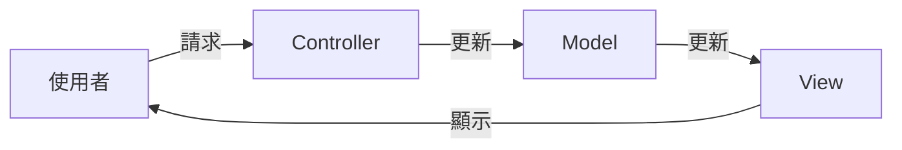

## 什麼是 MVC？

MVC (Model-View-Controller) 是一種軟體設計模式，它將應用程式分成三個核心元件：**模型 (Model)**、**視圖 (View)** 和 **控制器 (Controller)**。這種分離可以讓程式碼更容易維護、測試和重複使用。

### 模型 (Model)

模型是應用程式的核心，它負責處理應用程式的資料和業務邏輯。模型與資料庫互動，並提供資料給視圖。

### 視圖 (View)

視圖是使用者介面，它負責將模型提供的資料呈現給使用者。視圖通常是 HTML、CSS 和 JavaScript 的組合。

### 控制器 (Controller)

控制器是模型和視圖之間的橋樑。它接收使用者的輸入，並呼叫模型和視圖來完成使用者的請求。

## MVC 的優點

-   **關注點分離 (Separation of Concerns):** MVC 將應用程式的不同功能分離到不同的元件中，讓程式碼更容易理解和維護。
-   **可重複使用性 (Reusability):** 模型可以被多個視圖重複使用，控制器也可以被多個應用程式重複使用。
-   **可測試性 (Testability):** 因為元件是分離的，所以可以獨立地對每個元件進行測試。

## MVC 的缺點

-   **複雜性:** 對於小型的應用程式來說，MVC 可能會過於複雜。
-   **學習曲線:** MVC 的學習曲線可能比較陡峭，特別是對於初學者來說。
