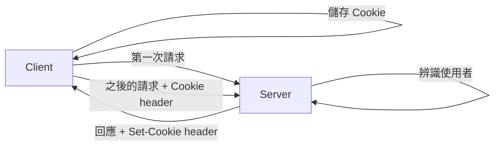

## 什麼是 Cookie？

HTTP 是一個**無狀態 (stateless)** 的協定，這意味著伺服器不會記住任何關於使用者的資訊。為了解決這個問題，Cookie 就誕生了。

Cookie 是一個儲存在瀏覽器中的小型文字檔案，它會在瀏覽器發送請求給伺服器時，一併被帶上。伺服器可以透過 Cookie 來辨識不同的使用者，並記住他們的狀態，例如登入資訊、購物車內容等。

## Cookie 的運作方式



1.  當瀏覽器第一次發送請求給伺服器時，伺服器會在回應的 header 中加上一個 `Set-Cookie` 的欄位，並在裡面放入要儲存的 Cookie 資料。
2.  瀏覽器收到回應後，會將 Cookie 儲存起來。
3.  之後瀏覽器再發送請求給同一個伺服器時，就會在請求的 header 中加上一個 `Cookie` 的欄位，並將之前儲存的 Cookie 資料放進去。
4.  伺服器收到請求後，就可以透過 `Cookie` 欄位中的資料來辨識使用者。

## Cookie 的屬性

在 `Set-Cookie` header 中，我們可以設定 Cookie 的一些屬性，來控制 Cookie 的行為：

-   **`Expires` / `Max-Age`**: 設定 Cookie 的過期時間。`Expires` 是設定一個絕對的日期和時間，而 `Max-Age` 是設定一個相對的秒數。
-   **`Path`**: 設定 Cookie 在哪個路徑下才會被送出。
-   **`Domain`**: 設定 Cookie 在哪個網域下才會被送出。
-   **`Secure`**: 如果設定了這個屬性，Cookie 只會在 HTTPS 連線中被送出。
-   **`HttpOnly`**: 如果設定了這個屬性，Cookie 將無法被 JavaScript 的 `document.cookie` API 所存取，可以有效地防止 XSS 攻擊。

## PHP 範例

在 PHP 中，我們可以使用 `setcookie()` 函式來設定 Cookie：

```php
<?php

$cookie_name = "user";
$cookie_value = "John Doe";
$expire = time() + (86400 * 30); // 86400 = 1 day

setcookie($cookie_name, $cookie_value, $expire, "/", "", false, true);

?>
```